## Enable CAN-WiFi Bridge<a name="step8"></a>

### Purpose

This example application bridge the CAN Bus and Wi-Fi peripherals to enable data transfer between CAN nodes and Wi-Fi peripherals.

<p align="center">
<a href="https://www.microchip.com/en-us/products/wireless-connectivity/embedded-wi-fi/pic32mz-w1-wi-fi-soc-and-module-family" target="_blank">
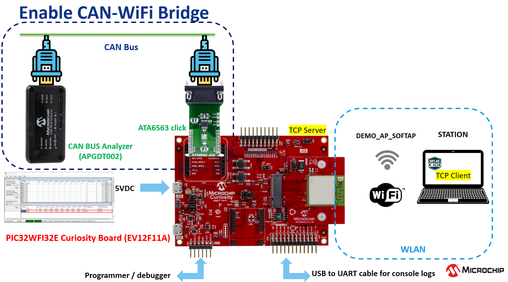</a>
</p>

### Description

This sample application demonstrates how to bridge up the CAN Bus and Wi-Fi peripherals on the WFI32E device which is running in SoftAP Mode. This concentrator device allows to connect the physical CAN-bus to WLAN network. A third-party STA will connect to the WFI32E SoftAP device and a third-party CAN Bus node ([Microchip CAN Bus Analyzer](http://www.microchip.com/Developmenttools/ProductDetails/APGDT002)) will connect to the CAN Bus of the WFI32E device.

<p align="center">
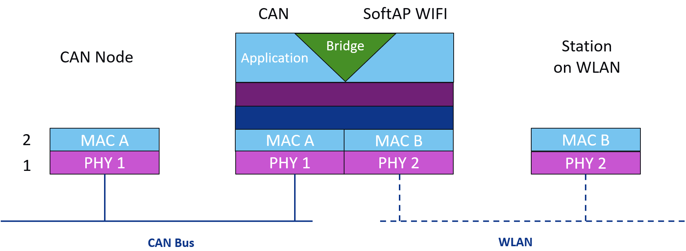
</p>

A TCP Client on the third-party STA will then connect to the TCP Server running on the WFI32E Bridge device. Once connected, the WFI32E device will be able to transmit or receive the network data from the TCP Client. The WFI32E device can also transmit or receive CAN Bus messages from the third-party CAN Bus node.

In this example, the CAN messages are sent from the [Microchip CAN Bus Analyzer](http://www.microchip.com/Developmenttools/ProductDetails/APGDT002). The WFI32E Bridge device forward the CAN Bus messages to the TCP Client (python script) running on a third party STA (computer). The TCP Client (python script) echoes the same message back to the SoftAP device and the WFI32E forward the message back to the CAN Node ([Microchip CAN Bus Analyzer](http://www.microchip.com/Developmenttools/ProductDetails/APGDT002)).

<p align="center">
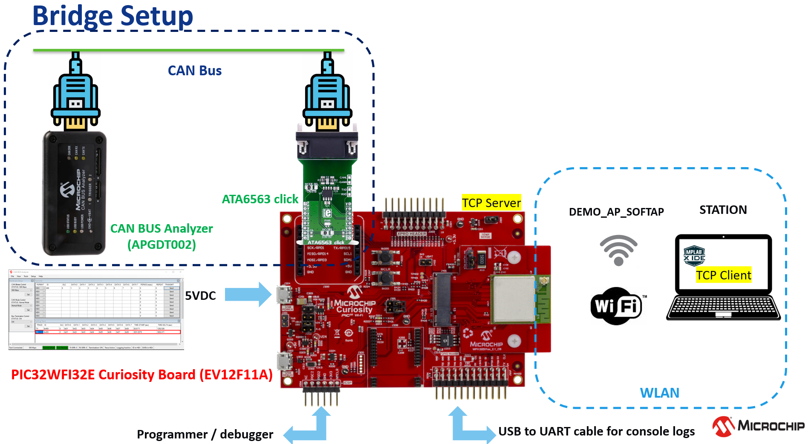
</p>

### Software requirement

- [CAN Bus Analyzer Software v2.3](https://www.microchip.com/Developmenttools/ProductDetails/APGDT002)
(The tool requires .NET Framework 3.5, if you are facing an issue while installing it on a Windows 10 computer, checkout [here](https://answers.microsoft.com/en-us/windows/forum/all/error-code-0x80240438-while-downloading-net/32e2ab95-526a-4b90-88a8-a118788ecaa7)).

The sample project has been created and tested with the following Software Development Tools:
- MPLAB X IDE v5.50
- MPLAB XC32 v2.50
- MPLAB Harmony v3.6.4
   - mhc v3.7.1
   - csp v3.9.1
   - core v3.9.1
   - wireless_wifi v3.4.1
   - dev_packs v3.9.0
   - wireless_system_pic32mzw1_wfi32e01 v3.4.1
   - wolfssl v4.7.0
   - net v3.7.2
   - crypto v3.7.1
   - CMSIS-FreeRTOS v10.3.1

- Python to run the TCP Client Script

### Hardware setup

* To run the demo, the following additional hardware are required:

   - [Microchip CAN Bus Analyzer Hardware](https://www.microchip.com/Developmenttools/ProductDetails/APGDT002)
   - [ATA6563 click board](https://www.mikroe.com/ata6563-click)
   - USB-to-UART cable

- Computer connected to [WFI32 Curiositiy board](https://www.microchip.com/DevelopmentTools/ProductDetails/PartNO/EV12F11A) over USB POWER (J204)
- J202 = VBUS
- J301 = open

- USB-to-UART cable between the computer and GPIO Header UART1 pins (Rx, GND, Tx) to observe the console logs.

- Connect thru wiring the [ATA6563 click board](https://www.mikroe.com/ata6563-click) to the PIC32MZ W1 Curiosity Board as per the Pi connection below:

| PIC32MZ W1 Curiosity Board | ATA6563 click board |
| ---------------------------| ------------------- |
| AN (RPA14), mikroBUS connector | TX (pin 14) |
| PWM (RPB12), mikroBUS connector | RX (pin 13) |
| +3.3V, mikroBUS connector | 3V3 (pin 7) |
| +5V, mikroBUS connector | 5V (pin 10) |
| GND, mikroBUS connector | GND (pin 9) |

<p align="center">
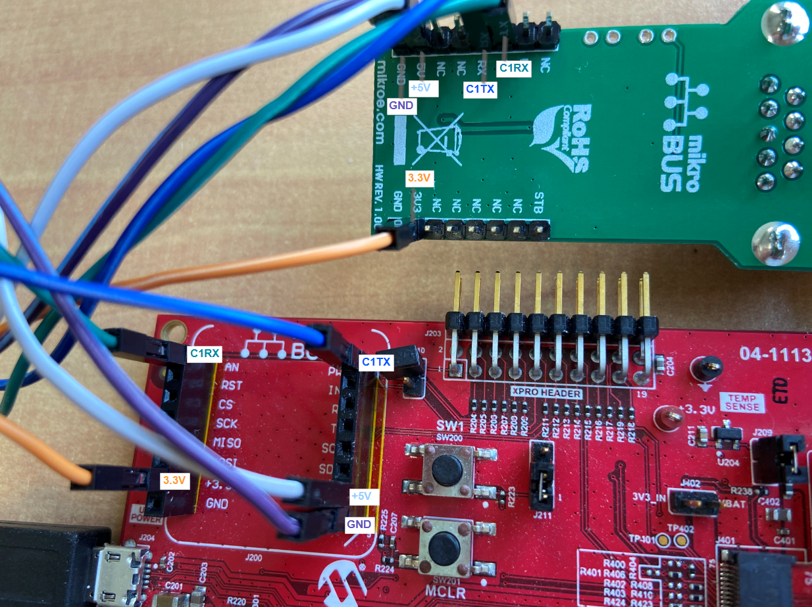
</p>

- Connect [Microchip CAN Bus Analyzer Hardware](https://www.microchip.com/Developmenttools/ProductDetails/APGDT002) to [ATA6563 click board](https://www.mikroe.com/ata6563-click) using female to female DB9 serial cable.
On both end, the wiring must be direct between the relevant signals:

<p align="center">
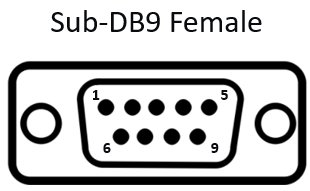
</p>

| Pin no | Signal |
| ------ | ------ |
| 1 | - |
| 2 | CAN-Low |
| 3 | GND |
| 4 | - |
| 5 | - |
| 6 | - |
| 7 | CAN-High |
| 8 | - |
| 9 | - |

- Connect [Microchip CAN Bus Analyzer Hardware](https://www.microchip.com/Developmenttools/ProductDetails/APGDT002) to PC using USB Male-A to Male Mini-B cable

- A laptop / mobile device is needed to run the TCP Client script


### ATA6553 click

The [ATA6563 click board](https://www.mikroe.com/ata6563-click) carries the [AT6563](https://www.microchip.com/wwwproducts/en/ata6563) high-speed CAN transceiver. The transceiver is designed for high-speed (up to 5 Mbps) CAN applications in the automotive industry, providing differential transmit and receive capability to (a microcontroller with) a CAN protocol controller. It offers improved electromagnetic compatibility (EMC) and electrostatic discharge (ESD) performance. The transceiver is CAN FD (Flexible data-rate) ready, meaning it has increased data rates in comparison with classic CAN. Check out the [AT6563 datasheet](https://www.microchip.com/wwwproducts/en/ata6563) for more details.

In this demo application, the [ATA6563 click board](https://www.mikroe.com/ata6563-click) communicates with the WFI32 MCU through **CAN1 Bus Lines**.

<p align="center">
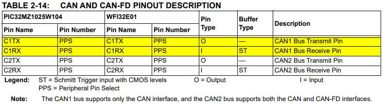
</p>

With PPS, the CAN1 RX Line (C1RX) is routed to pin RPA14.

<p align="center">
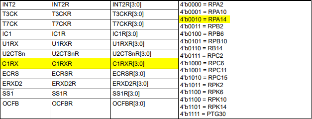
</p>

And the CAN1 TX Line (C1TX) is routed to pin RPB12.

<p align="center">
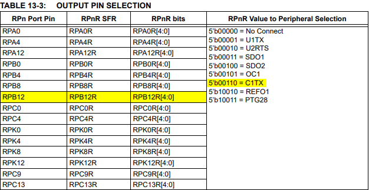
</p>

### Try it

1. Clone/download the repo
2. Open the project with MPLAB X IDE
3. Open Harmony Configurator

<p align="center">
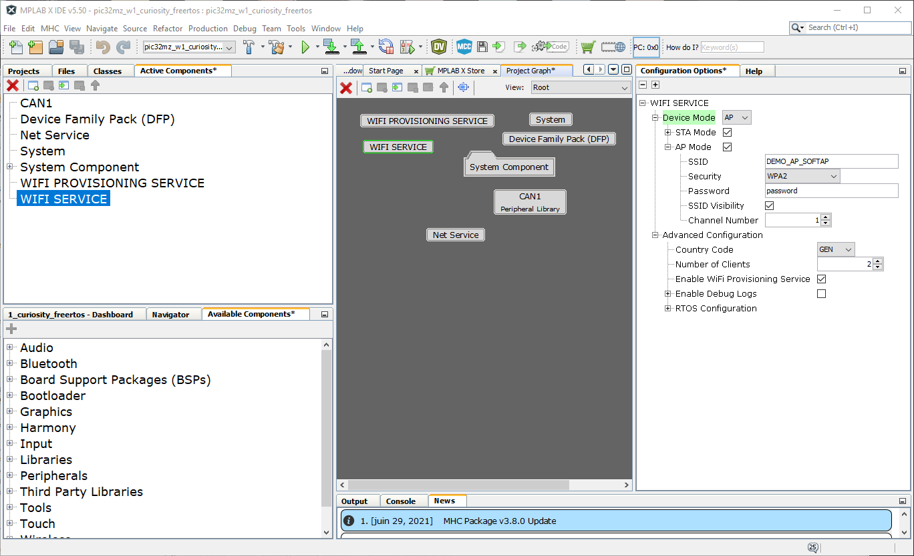
</p>

5. Under **Project Graph > Root**, set the AP parameters required for a station device to connect to the Bridge in **WIFI SERVICE**

<p align="center">
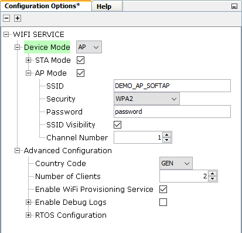
</p>

6. Under **Project Graph > Root**:
   * Select **Net Service**
   * Currently, **NetService** is configured to run a **TCP Server** which awaits connection from a TCP Client on port **5555**.

7. (if required) Save configurations and generate code via MHC
8. Build and program the code
9. Open a serial terminal (e.g. Tera Term) on the computer
10. Connect to the USB-to-UART COM port and configure the serial settings as follows:
    * Baud: 115200
    * Data: 8 Bits
    * Parity: None
    * Stop: 1 Bit
    * Flow Control: None
11. Reset WFI32E Curiosity Board by pressing MLCR button
12. The bridge device shall come up as SoftAP and then as per the default Net Service configuration, the TCP Server shall come up, awaiting a connection from a TCP Client.
<p align="center">
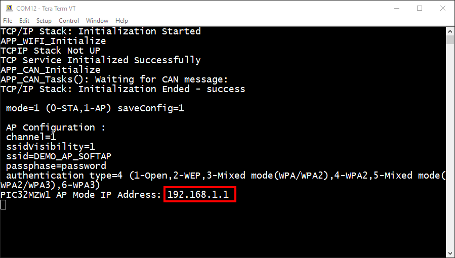
</p>

13. Connect a Station (Laptop) to the SoftAP (with ssid DEMO_AP_SOFTAP) running on the WFI32E device
<p align="center">
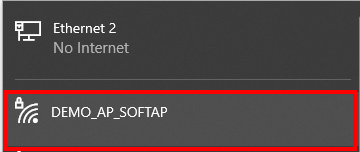
</p>

14. Observe the Station connected to SoftAP device
<p align="center">
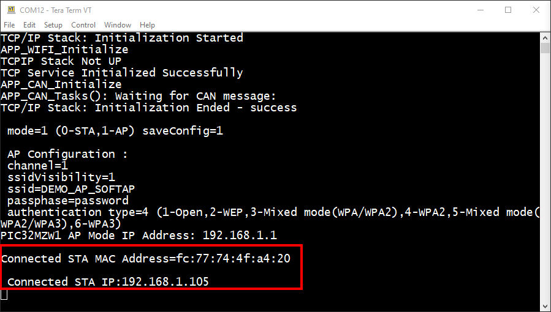
</p>

15. Start a TCP Client using Python Script on laptop, giving the server IP as the PIC32MZW1 AP Mode IP Address, and the TCP port as 5555
```
tcp_client <SoftAP Ip Address> <Port No>
```

<p align="center">
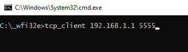
</p>

16. TCP Server received a connection
<p align="center">
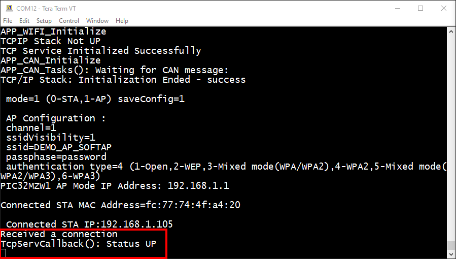
</p>

17. TCP Client is ready to receive data
<p align="center">
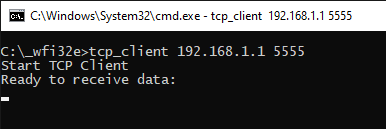
</p>

18. Open [CAN Bus Analyzer](https://www.microchip.com/Developmenttools/ProductDetails/APGDT002) software and make the following configurations:

| Description | Settings |
| ----------- | -------- |
| CAN Bitrate Control | 500 Kbps |
| CAN Mode Control | Normal |
| Bus Termination Control | ON |

<p align="center">
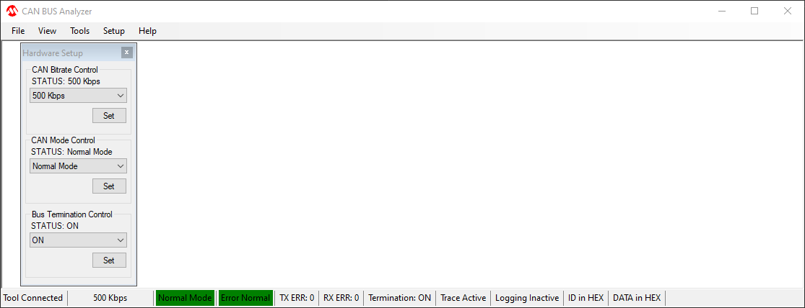
</p>

19. Under **Tools -> Transmit**, send following CAN message from [CAN Bus Analyzer](https://www.microchip.com/Developmenttools/ProductDetails/APGDT002) software

    * ID: 0x469, DLC: 8, DATA: 1, 2, 3, 4, 5, 6, 7, 8

<p align="center">
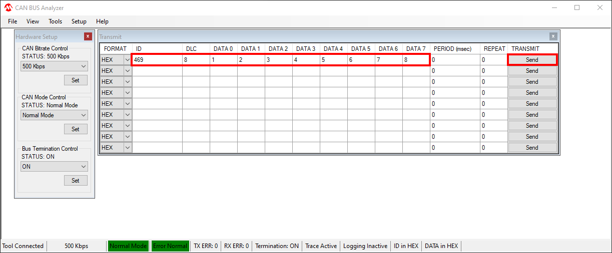
</p>

20. WFI32E Bridge display the message received on the console
<p align="center">
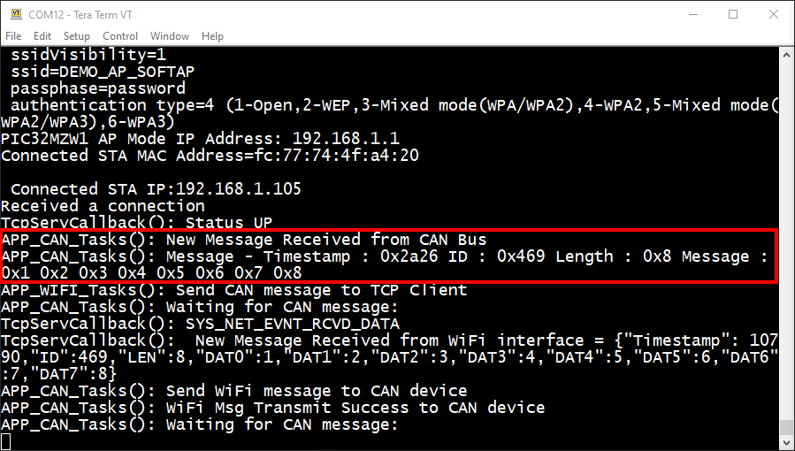
</p>

21. The Server transfer the CAN message received to the TCP Client. You can observe the CAN message on laptop command prompt.
<p align="center">
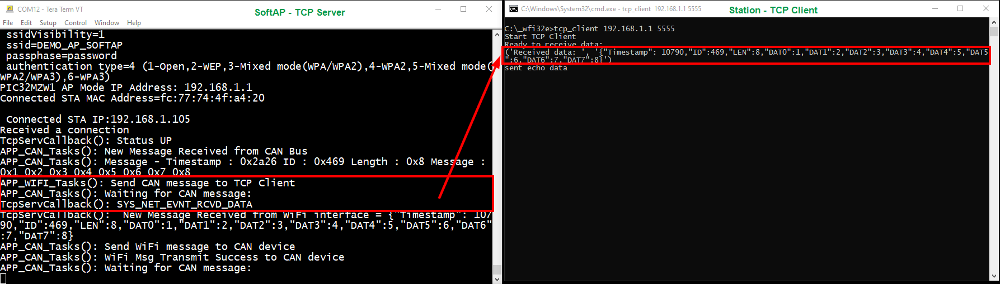
</p>

22. The TCP Client echo the same message back to the WFI32E (TCP Server).
<p align="center">
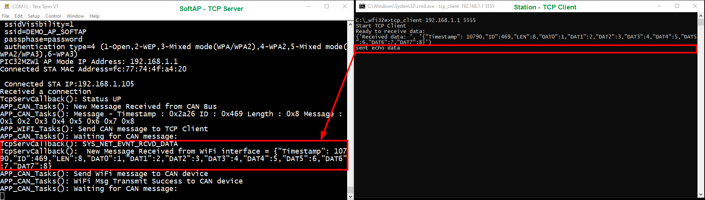
</p>

22. The WFI32E Bridge transfer the TCP Client message to the CAN Bus.\
[CAN Bus Analyzer](https://www.microchip.com/Developmenttools/ProductDetails/APGDT002) software receives the message under **Tools -> Rolling Trace**.

<p align="center">
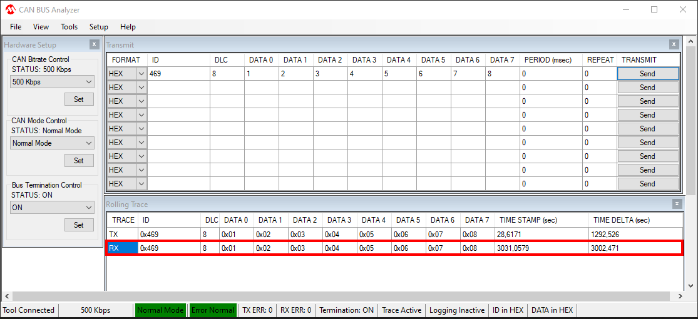
</p>

### Demo

<p align="center">

</p>