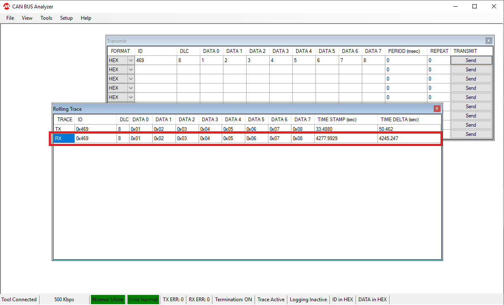

# CAN-WiFi Bridge 

This example application brigde the CAN Bus and Wi-Fi pheriphials, transfer the data between the CAN Bus and Wi-Fi pheriphials

## Description

This application demonstrates how a user can brigde up the CAN Bus and Wi-Fi pheriphials on the device which is running in Soft AP Mode.  A third-party STA will connect to the Soft AP device and a third-party CAN Bus nodes ([Microchip CAN Bus Analyzer](http://www.microchip.com/Developmenttools/ProductDetails/APGDT002)) will connect to the CAN Bus of the device. The TCP Client on the third-party STA will then connect to the TCP Server running on the device and the device can transmit or receive the network data form the TCP client. The device can also transmit or receive the CAN Bus message from the third-party CAN Bus nodes

In this example, user send a CAN Bus message from the Microchip CAN Bus Analzser, the device forward the CAN Bus message to a TCP client (python script) on PC (thrid-party STA). The TCP client (python script) echo the same message back to the device and the device forware the message back to the CAN Bus Analyzer 

## Downloading and building the application

To download or clone this application from Github, go to the [top level of the repository](https://github.com/Microchip-MPLAB-Harmony/wireless)

Path of the application within the repository is **apps/can_wifi_bridge/firmware** .

To build the application, refer to the following table and open the project using its IDE.

| Project Name      | Description                                    |
| ----------------- | ---------------------------------------------- |
| pic32mz_w1_curiosity_freertos.X | MPLABX project for PIC32MZ W1 Curiosity Board |
|||

## Setting up PIC32MZ W1 Curiosity Board
- To run the demo, the following additional hardware are required:
  - [Microchip CAN Bus Analyzer](http://www.microchip.com/Developmenttools/ProductDetails/APGDT002)
  - [ATA6563 click board](https://www.mikroe.com/ata6563-click)
  - [USB UART click board](https://www.mikroe.com/usb-uart-click)

- Install [Microchip CAN Bus Analyzer](http://www.microchip.com/Developmenttools/ProductDetails/APGDT002) software on PC
- Connect [Microchip CAN Bus Analyzer](http://www.microchip.com/Developmenttools/ProductDetails/APGDT002) to [ATA6563 click board](https://www.mikroe.com/ata6563-click) using female to female DB9 serial cable
- Connect [ATA6563 click board](https://www.mikroe.com/ata6563-click) to the PIC32MZ W1 Curiosity Board as per the Pin connections shown below

    | PIC32MZ W1 Curiosity Board | ATA6563 click board  |
    | -------------------------- | -------------------- |
    | PWM(RPB12), mikroBUS Connector | RX (PIN 14)  |
    | AN(RPA14), mikroBUS Connector  | TX (PIN 13)  |
    | +3.3V, mikroBUS Connector | 3V3 (PIN 7)  |
    | +5V, mikroBUS Connector   | 5V (PIN 10) |
    | GND, mikroBUS Connector   | GND (PIN 9)  |

- Connect [Microchip CAN Bus Analyzer](http://www.microchip.com/Developmenttools/ProductDetails/APGDT002) to PC using USB Male-A to Male Mini-B cable
- Connect the Debug USB port on the board to the computer using a micro USB cable
- On the GPIO Header (J207), connect U1RX (PIN 13) and U1TX (PIN 23) to TX and RX pin of any USB to UART converter
- Laptop/ Mobile (to run the TCP Client on it)

## Running the Application

1. Open the project and launch Harmony3 configurator.

2.	Currently Net Service is configured to run as TCP Server running on port 5555. In case the user wants to change this config, please make the changes in the Net Service Module as shown below:

3. Currently Net Service is configured to run a TCP Server which awaits connection from a TCP Client on port 5555. In case the user wants to change this config, please make the changes in the Net Service Module configurations as shown below:

4.	Save configurations and generate code via MHC 
5.	Build and program the generated code into the hardware using its IDE
6. Open the Terminal application (Ex.:Tera term) on the computer
7. Connect to the "USB to UART" COM port and configure the serial settings as follows:
    - Baud : 115200
    - Data : 8 Bits
    - Parity : None
    - Stop : 1 Bit
    - Flow Control : None

8.  Open [Microchip CAN Bus Analyzer](http://www.microchip.com/Developmenttools/ProductDetails/APGDT002) software and make the following configurations:

    |Description | Settings  |
    | ---------- | --------- |
    | CAN Bitrate Control | 500 Kbps |
    | CAN Mode Control | Normal Mode |
    | Bus Termination Control | ON  |
    |||

9.	The device shall come up as SoftAP and then as per the default Net Service configuration, the TCP Server shall come up, awaiting a connection from a TCP Client.

10.	Connect a Laptop to the Soft AP (with ssid DEMO_AP_SOFTAP) running on the DUT
11. Start a TCP Client (python script) on laptop, giving the server IP as the IP of the Board, and the port as 5555:

    

12. Send following CAN message from CAN analyzer software
    - ID : 0x469, DLC : 8, Data: 1, 2, 3, 4, 5, 6, 7, 8

13. CAN message will be displayed on device console  

14. The device transfer the CAN message received to the TCP Client (python script). You can see the CAN message on laptop command prompt

15. The TCP Client (python script) echo the same message back to the device. You can see the echo message on device console

16. The device transfer the TCP Client message to the CAN Bus. CAN Bus Analyzer receive the message

